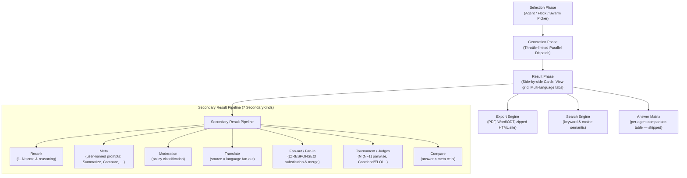

# Reports Section: Functional & Architectural Analysis

An in-depth, code-level review of the **Reports** section of the Android
multi-provider AI client: what it does today, where the real product and
technical gaps are, and which premium features would move the needle. This
is an analysis/roadmap doc, not a reference — for the authoritative
mechanics see the sibling docs linked throughout (`secondary-results.md`,
`tournament-judges-compare.md`, `throttle.md`, `regenerate.md`,
`report-icons.md`, `costs.md`).

---

## 1. Executive Summary of Current Architecture

The Reports engine is the core differentiator of this application. It runs
parallel prompts against many providers and models, layers a rich set of
secondary aggregations on top, and orchestrates resumable multi-stage
workflows.

> **Terminology note.** The secondary pipeline is built on a single enum,
> `SecondaryKind`, with **exactly seven** values:
> `RERANK, META, MODERATION, TRANSLATE, TOURNAMENT, JUDGES, COMPARE`
> (`data/SecondaryModels.kt`). "Compare", "Critique", and "Synthesize" are
> **not** built-in operations — they are example *user-defined* names for
> `category="meta"` internal prompts (only `summarize` and `compare` ship
> as seed assets). The kind is always `META`; the user-given name is the
> only thing that distinguishes one Meta from another. See
> [secondary-results.md](secondary-results.md) and
> [tournament-judges-compare.md](tournament-judges-compare.md).

### Key technical achievements in the codebase
*   **Two-layer quota throttling.** Outbound requests are governed by two
    independent layers: a per-hostname `ProviderThrottle` (sliding-window
    rate limit + concurrency gate; defaults **5 concurrent calls** and **60
    calls/minute** per provider) and a per-flow `ApiCallCaps` coroutine
    semaphore set (`global=100`, `report/translation/fanOut/fanMeta/workers=50`).
    Batch dispatch acquires permits in the canonical **sub-cap → global →
    host** order and, while *parked* on a saturated provider's host gate,
    holds neither the sub-cap nor the global permit (commit `6ab023c9c`
    hardened all seven report-primary dispatch sites to this park-friendly
    path). Two retry interceptors — `RateLimitRetryInterceptor` (HTTP 429)
    and `OverloadedRetryInterceptor` (HTTP 529) — each retry **3 times with
    1 000 ms exponential-jitter backoff** by default, on background threads
    only (a main-thread guard prevents ANRs). See [throttle.md](throttle.md).
*   **Deleted-spending retention.** When a model or row is pruned, its
    spend is rolled into `Report.costsFromDeletedItems` so the lifetime
    figures shown in **AI Usage** and **Costs** still reconcile with actual
    API billing. `removeAgent` now rolls `max(agent-icon-field,
    structured-icon-call rows)` to recover alt/report icon spend that never
    bumped the agent's own icon cost (commit `b91aa7b22`). See [costs.md](costs.md).
*   **Resilient, phased task restoration.** `RegenerateBatchEngine`
    persists a per-report cursor under `<filesDir>/regenerate/<reportId>.json`
    and walks a fixed 10-phase pipeline (`TITLE, ICON, LANGUAGE, AGENTS,
    META, FAN_OUT, FAN_IN, TRANSLATIONS, FAN_META, TOURNAMENT`), pausing on
    the first errored row. A paused or app-killed batch is *detected* by the
    30 s read-only background scan and flagged on the ⚠️ Broken-work screen;
    the user fixes the row and taps Restart (no auto-resume). See
    [regenerate.md](regenerate.md).

### The View grid (Result phase)

The Result phase exposes a tile grid (`ui/report/view/Main.kt`). The
content tiles, in order, are **Prompt → Reports → Matrix → Costs → Icons**,
plus a conditional **Value view** tile (only when a rerank exists). The
**Matrix** tile (`doc:Matrix`, shipped in commit `8177a4e83`) opens the new
**Answer Matrix** screen described in §4. HTML preview, App Log, and Trace
are deliberately *not* in this grid — they live on Report-manage and the
result page's bottom bar.

---

## 2. Identified Functional & UX Gaps

A close read of `ui/report/` and the secondary pipelines surfaces these
product limits.

### ⚠️ Gap 1: No live per-card streaming preview during generation
*   **The reality (nuanced).** The Generation screen now dispatches via
    `analyzeWithAgentStreaming` — it *does* open an SSE stream per agent,
    purely to keep long connections alive and to match the non-streaming
    cost/result exactly. **However, the live per-chunk row preview was
    deliberately removed**: the streaming callback is
    `{ /* chunk ignored — no live preview */ }` (`ReportViewModel.kt`
    ~line 838). Each model card still shows a spinning `⏳` and stays blank
    until the *entire* response lands and is persisted.
*   **Product impact.** For long-reasoning models (`o3`, `deepseek-r1`,
    Claude with extended thinking) or long essays, the user waits in
    silence. Single Chat, by contrast, paints tokens as they arrive. The
    plumbing to re-enable a live preview is mostly present (the stream is
    already open and chunked); what's missing is accumulating chunks into a
    per-agent `UiState` field and recomposing the card.

### ❌ Gap 2: Static meta prompts (no "Meta-conversations")
*   **The issue.** A Meta result (e.g. a Compare or Critique run) is a
    single-shot row. The user cannot ask a follow-up — *"Why did you call
    Model B more formal than Model A?"* — without copy-pasting into a
    separate Chat session and losing the structured link to the report.
*   **Partial mitigation already present.** Meta and Fan-out rows do carry a
    `chatMessages` field on `SecondaryResult`, and report agents support an
    in-place agent chat. The gap is that there is no first-class
    "continue this Meta as a chat" entry point.

### ❌ Gap 3: Missing visual response diffing
*   **The issue.** Comparing a multi-model response matrix is still a
    read-side-by-side or "generate a Compare prompt" exercise. There is no
    built-in **word-level diff** (additions / deletions / phrasing shifts).
*   **Partial mitigation.** The new **Answer Matrix** (§4) extracts a
    structured per-agent summary (stance, confidence, recommendation, risks,
    cost, latency, tokens) so close variants can be scanned in one table —
    but it does *not* diff prose.
*   **Product impact.** Comparing near-identical models
    (`gpt-4o` vs `gpt-4o-mini`, or a single system-prompt tweak) still means
    manual line-by-line reading.

### ❌ Gap 4: Ephemeral prompt versions (no revision timeline)
*   **The issue.** Editing a prompt and tapping **Regenerate** either
    replaces content in-place or spawns a brand-new report. There is no
    historic timeline of prompt variations *within* one report.
*   **Product impact.** Three prompt tweaks become three disconnected
    reports in the history hub instead of one unified "Prompt A vs B vs C"
    study.

### ❌ Gap 5: Static HTML exports
*   **The issue.** The zipped-HTML site export (`buildZippedHtmlBytes` in
    `ui/helpers/ZippedHtmlExport.kt`, building on the shared HTML model in
    `ReportExport.kt`, alongside `PdfExport.kt` and `WordOdtExport.kt`) is
    well-designed but static. It emits a multi-page site with per-section
    directories and a tab-style view picker, yet lacks client-side
    interactivity — dynamic model filtering, sorting by length/cost, or
    in-page regex search.

---

## 3. Proposed Premium Features & Functional Roadmap

To elevate Reports from a utility into a premium research workshop, five
next-generation features, ordered by user demand.

### 🚀 Feature 1: Interactive response diffing (visual contrast)
Let users select two completed model cards and see a red/green word-level
or line-level highlighted diff of how their outputs diverge.
*   **Interface concept.**
    *   A **Compare Diffs** action in the result action bar.
    *   Pick two models (e.g. `Claude Opus 4.x` and `gpt-4o`).
    *   A split- or unified-pane view highlighting insertions (green) and
        deletions (red).
*   **Implementation.** Integrate a lightweight Kotlin diff-match-patch
    utility and render via Compose `AnnotatedString` with background spans.
    Complements the Answer Matrix (which summarizes) by showing the actual
    text delta.

### 🚀 Feature 2: Multi-turn Meta-chat threads
Turn any generated Meta result into an interactive chat thread, reusing the
existing `SecondaryResult.chatMessages` field.
*   **Interface concept.**
    *   A 💬 **Chat with this result** button on a Meta/Compare card.
    *   Opens a Chat session pre-seeded with: the original prompt, the
        full group responses, and the generated Meta prose.
    *   The user can then ask the model to rewrite, clarify, or summarize —
        with the conversation persisted back onto the row.

### 🚀 Feature 3: Live aggregated text streaming
Re-enable concurrent live streaming across cards in the Generation phase —
the SSE stream is already open per agent (see Gap 1); only the UI plumbing
was removed.
*   **Interface concept.**
    *   Replace the static `⏳` with text that streams into each card.
    *   Optional per-card live throughput indicator.
*   **Implementation.** Accumulate the per-chunk callback into a per-agent
    `UiState` field (`MutableStateFlow`) keyed by `resultId`, and let
    Compose recomposition paint it. The cost/result already freeze on
    completion, so the live preview is purely additive.

### 🚀 Feature 4: Prompt revision timelines (version trees)
Let one report hold multiple prompt iterations and show how tweaks shift
model behaviour.
*   **Interface concept.**
    *   A version slider at the top of the result screen:
        `v1 (Initial)` ── `v2 (Added Constraint)` ── `v3 (Few-shot)`.
    *   Sliding instantly swaps the displayed responses, costs, and
        metadata, all under one logical report ID — directly addressing
        Gap 4.

### 🚀 Feature 5: Cross-report RAG & reference ingestion
Let users ingest an entire report (prompt, responses, costs, traces) into a
**Knowledge Base** as a reference source.
*   **Interface concept.**
    *   An **Ingest into Knowledge Base** action on the Manage overlay.
    *   Parses the report JSON and feeds the structured text into the RAG
        system as a chunked document.
    *   Future prompts query it by cosine similarity, drawing on past
        multi-model research. See [knowledge.md](knowledge.md) for the
        embedder/retrieval mechanics.

---

## 4. Shipped Since This Analysis Was First Written

### ✅ Answer Matrix view (commit `8177a4e83`)

A read-only **Answer Matrix** screen (`ui/report/view/AnswerMatrix.kt`,
`AnswerMatrixViewScreen`) now ships as a full-screen overlay reached from
the new **Matrix** tile in the View grid (between **Reports** and
**Costs**). It is a *pure presentation/derivation* screen — **no new API
calls and no new storage** — over existing `Report` data plus the latest
`RERANK` secondary result.

*   **Rows.** One row per `SUCCESS` agent with a non-blank response,
    ordinal = index+1, sorted by rerank rank ascending (null rank last),
    then ordinal.
*   **Columns.** `#` · Model (provider / title-or-`shortModelName`) · Rank
    (rerank rank + score) · Stance · Confidence · Recommendation · Risks ·
    Cost · Latency · Tokens. A summary card shows model count, ranked
    count, and total cost (in cents, `Locale.US`-formatted).
*   **Stance / Confidence / Recommendation / Risks are heuristic** —
    regex-text-mined from the response body (`extractMatrixSignals`), *not*
    model-reported. Stance ∈ {Refuses, Mixed, Recommends, Cautious,
    Neutral}; Confidence ∈ {Low, Medium, High}. It reads a `<conclusion>`
    tag and strips `<think>…</think>`.
*   **Translation-aware.** Honours the current language tab via a
    `translationByTarget` map keyed `AGENT:<agentId>` / `AGENT_TITLE:<agentId>`.
*   **Help.** Reuses the existing `view_ai_report` help topic — no dedicated
    Matrix help page exists.

This partially addresses **Gap 3** (side-by-side comparison) by giving a
single scannable table, though it summarizes rather than diffs prose, so
Features 1 and 4 remain the highest-value next steps.

---

> [!NOTE]
> Shipping **Visual Diffing** (Feature 1) and **Prompt Revision Timelines**
> (Feature 4) would close the two largest research requests still open:
> comparing close model variations at the text level, and tuning prompts
> iteratively without polluting the report hub. The **Answer Matrix** and
> the re-enable-able streaming plumbing (Feature 3) mean both are now
> incremental builds on existing infrastructure rather than greenfield work.
