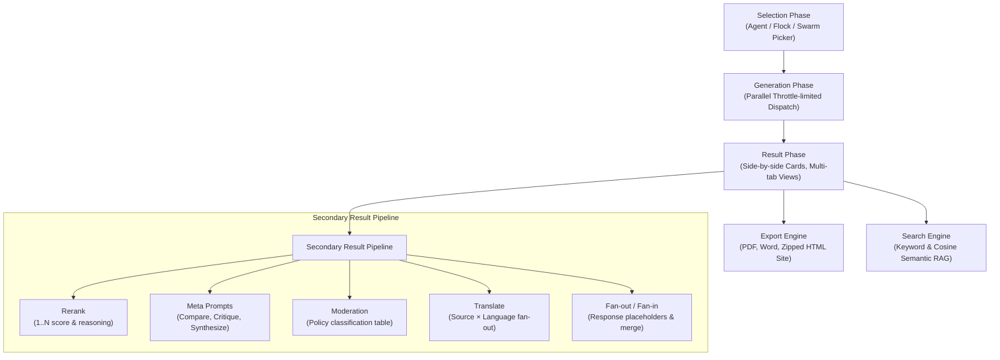

# Reports Section: Functional & Architectural Analysis

An in-depth code-level and functional review of the **Reports** section of the Android multi-provider AI client, detailing the current capabilities, identified product and technical gaps, and premium feature recommendations.

---

## 1. Executive Summary of Current Architecture

The Reports engine is the core differentiator of this application. It provides an exceptionally robust workspace for running parallel prompts against multiple providers and models, performing secondary aggregations, and orchestrating complex multi-stage workflows.

### Key Technical Achievements in the Codebase
*   **Layered Quota Throttling**: Outbound requests are governed by `ProviderThrottle` and `RateLimitRetryInterceptor` which enforce sliding-window rate-limiting and concurrency limits (default 3 concurrent calls) synchronously on background threads, preventing network failures and API bans.
*   **Deleted Spending Retention**: The cost tracking system keeps a `Costs from deleted items` record, ensuring that even if models or rows are pruned from a report, the underlying financial audit logs shown in the **AI Usage** and **Costs** views remain accurate and match actual API billing.
*   **Resilient Task Restoration**: Through `<filesDir>/regenerate/<reportId>.json` and `RegenerateBatchEngine`, the app retains a cursor state of multi-phase operations, allowing a batch run to resume if the process is killed in the background.

---

## 2. Identified Functional & UX Gaps

While the current system is highly functional, a deep review of `ui/report/` and its secondary pipelines reveals several key product limits and design bounds:

### ❌ Gap 1: No Real-Time Multi-Model Streaming Previews
*   **The Issue**: Single Chat supports real-time text streaming over SSE. However, in the Reports Generation screen, each model card shows a spinning hourglass `⏳` and is blank until the *entire* response completes. 
*   **Product Impact**: For long reasoning models (e.g. `o1`/`o3-mini`, `deepseek-r1`) or detailed essays, the user must wait up to a minute in total silence before seeing any text, degrading the premium feel.

### ❌ Gap 2: Static Meta Prompts (No "Meta-Conversations")
*   **The Issue**: Meta-results (like **Compare** or **Critique**) are single-shot operations. If a model generates a comparison grid of five other models, the user cannot ask follow-up questions to drill down (e.g. *"Why did you say Model B is more formal than Model A?"*).
*   **Product Impact**: The user must copy-paste the text out into a separate AI Chat session, losing the rich structured link to the original report.

### ❌ Gap 3: Missing Visual Response Diffing
*   **The Issue**: The core purpose of a multi-model report is comparing response matrices. Currently, the user has to read them side-by-side or generate a textual "Compare" prompt. There is no built-in **visual text diffing engine** (highlighting word-level additions, deletions, and phrasing shifts).
*   **Product Impact**: Comparing highly similar models (e.g., `gpt-4o` vs `gpt-4o-mini`, or a Claude system prompt change) requires manual line-by-line reading.

### ❌ Gap 4: Ephemeral Prompt Versions (No Revision Timeline)
*   **The Issue**: When editing a prompt and tapping **Regenerate**, the user either replaces the existing content in-place or has to create a brand-new report. There is no historic timeline of prompt variations *within* the same report.
*   **Product Impact**: Tweaking a prompt three times results in three disconnected reports in the history hub, rather than a single unified study of "Prompt Version A vs. B vs. C".

### ❌ Gap 5: Static HTML Exports
*   **The Issue**: The zipped HTML export is beautifully designed but acts as a static document. It has a basic tabbed view, but lacks client-side interactive capabilities (like filtering out specific models dynamically, sorting responses by length/cost, or running instant regex search).

---

## 3. Proposed Premium Features & Functional Roadmap

To elevate the Reports section from a utility into a premium research workshop, we propose implementing five next-generation features:

### 🚀 Feature 1: Interactive Response Diffing (Visual Contrast)
Provide a visual contrast mode where users select two completed model cards and see a red/green line-by-line or word-by-word highlighted diff showing exactly how their outputs diverge.
*   **Interface Concept**:
    *   A **Compare Diffs** button in the top action bar.
    *   Select two models (e.g., `Claude 3.5 Sonnet` and `GPT-4o`).
    *   An inline split-pane or unified-pane display highlighting insertions (green) and deletions (red).
*   **Code Implementation**: Integrate a lightweight Kotlin/Java diff-match-patch utility, and render the output using Jetpack Compose `AnnotatedString` with highlighted background colors.

### 🚀 Feature 2: Multi-Turn Meta-Chat Threads
Turn any generated Meta result (Compare, Critique, Synthesize) into an interactive chat thread.
*   **Interface Concept**:
    *   At the bottom of a Compare card, show a 💬 **Chat with this Comparison** button.
    *   Tapping it opens a Chat session pre-seeded with a system instruction that contains:
        1. The original prompt.
        2. The full responses of the comparison group.
        3. The generated Compare prose.
    *   The user can then chat dynamically to ask the AI to rewrite the comparison, clarify points, or summarize findings.

### 🚀 Feature 3: Live Aggregated Text Streaming
Enable concurrent, live text streaming across multiple cards in the **GenerationPhase** screen.
*   **Interface Concept**:
    *   Instead of static hourglasses `⏳`, completed words/characters stream into the model cards in real-time.
    *   An animated scroll-indicator on active streaming cards showing live speeds.
*   **Code Implementation**: Modify `ReportViewModel` to flow SSE streams for concurrent active jobs into the `UiState` via `MutableStateFlow` bindings, leveraging Compose’s sub-second recomposition to paint the screen smoothly.

### 🚀 Feature 4: Prompt Revision Timelines (Version Trees)
Allow a single report to contain multiple iterations of the prompt, letting the user view a matrix of how prompt tweaks affect model behavior over time.
*   **Interface Concept**:
    *   An interactive slider at the top of the Results screen showing: `v1 (Initial)` ── `v2 (Added Constraint)` ── `v3 (Few-shot Examples)`.
    *   Sliding between versions instantly switches the displayed responses, costs, and metadata, keeping the history organized under a single logical report ID.

### 🚀 Feature 5: Cross-Report RAG & Reference Ingestion
Enable users to immediately ingest an entire Report (prompt, responses, costs, and traces) into a **Knowledge Base** as a reference source.
*   **Interface Concept**:
    *   Under the **Create** or **Manage** overlay, add **Ingest into Knowledge Base**.
    *   This parses the report JSON and feeds the structured text directly into the experimental RAG system as a chunked document.
    *   Future prompts can query this knowledge base using semantic cosine similarity, drawing upon past multi-model research deterministically.

---

> [!NOTE]
> Integrating **Visual Diffing** (Feature 1) and **Prompt Revision Timelines** (Feature 4) would address the two largest user research requests: comparing close variations of models, and tuning prompt guidelines iteratively without polluting the report hub.
